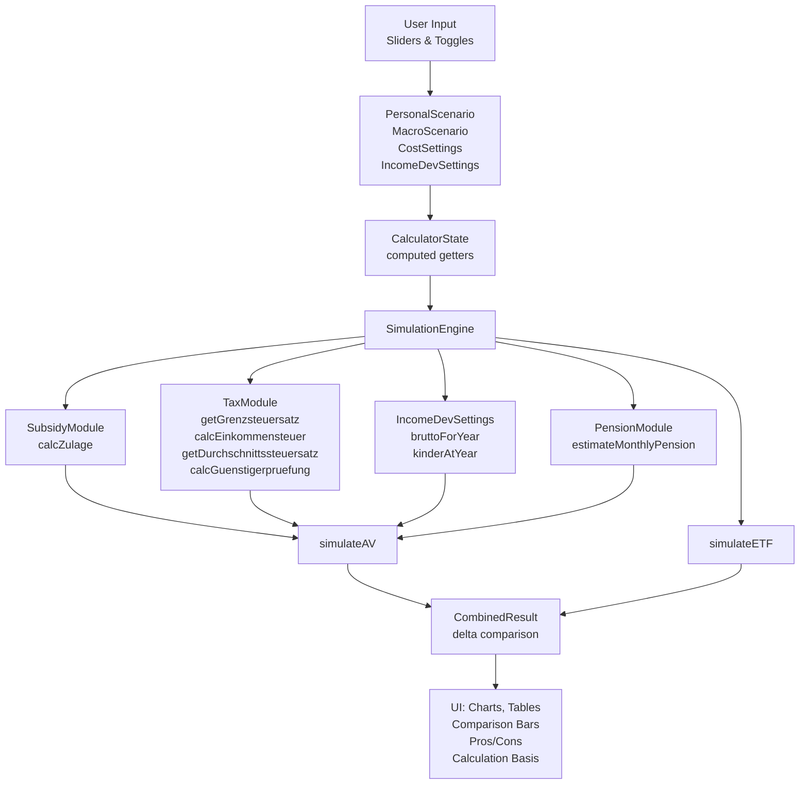
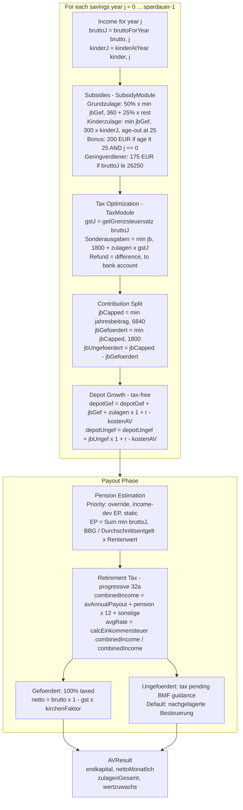
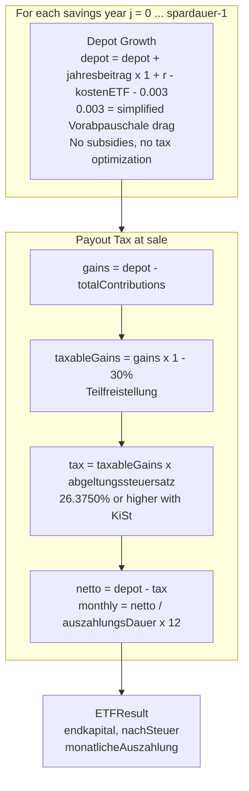
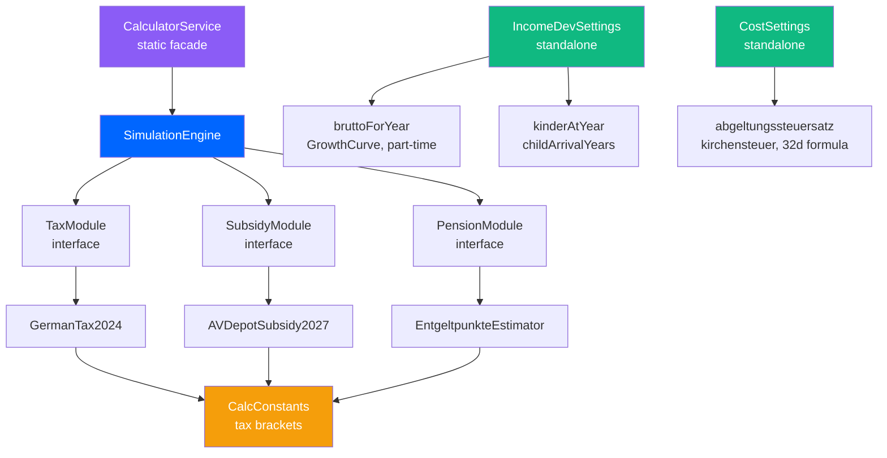

# Calculation Map

End-to-end trace of how user inputs flow through the calculation engine to produce results.

## Pipeline Overview

---

## Input Model Mapping

| UI Input | Model Field | Unit | Used By |
|----------|------------|------|---------|
| Monthly Savings | `PersonalScenario.sparrate` | EUR/month | `jahresbeitrag` x12, subsidy calc, depot accumulation |
| Gross Annual Income | `PersonalScenario.brutto` | EUR/year | tax rate, Geringverdienerbonus, pension EP, income dev base |
| Number of Children | `PersonalScenario.kinder` | count | Kinderzulage (may change with child timing) |
| Starting Age | `PersonalScenario.alterStart` | years | Berufseinsteigerbonus eligibility, savings duration |
| Retirement Age | derived as `spardauer` | years | payout duration (85 - retirement age) |
| State Pension | `PersonalScenario.gesetzlicheRente` | EUR/month | retirement tax calculation |
| Other Income | `PersonalScenario.sonstigeEinkuenfte` | EUR/year | retirement tax calculation |
| Return p.a. | `MacroScenario.rendite` | ratio/year | depot growth |
| Inflation p.a. | `MacroScenario.inflation` | ratio/year | real value calculation |
| AV Cost | `CostSettings.kostenAV` | ratio/year | deducted from return |
| ETF Cost | `CostSettings.kostenETF` | ratio/year | deducted from return |
| Kirchensteuer | `CostSettings.kirchensteuer` | ratio (0/0.08/0.09) | `abgeltungssteuersatz` getter, AV payout tax |
| Income Growth | `IncomeDevSettings.*` | various | year-by-year brutto, dynamic kinder |

---

## AV-Depot Simulation Flow

---

## ETF-Depot Simulation Flow

---

## Module Dependency Map

---

## What Affects What

| Changed Input | Affects Depot Capital | Affects Net Payout | Affects Subsidies |
|---------------|----------------------|-------------------|-------------------|
| Savings Rate | yes, directly | yes | yes, via contribution |
| Gross Income | no | yes, retirement tax | Only Geringverdienerbonus |
| Children | no | no | yes, Kinderzulage |
| Starting Age | yes, longer compounding | yes | yes, Berufseinsteigerbonus |
| Retirement Age | yes, duration | yes, payout years | no |
| State Pension | no | yes, retirement tax | no |
| Other Income | no | yes, retirement tax | no |
| Return p.a. | yes, directly | yes | no |
| AV/ETF Cost | yes, reduces return | yes | no |
| Kirchensteuer | no | yes, both AV + ETF | no |
| Income Growth | no | yes, pension + tax | Only Geringverdienerbonus timing |
| Macro Scenario | yes, return + inflation | yes | no |

---

## File Locations

| Component | File |
|-----------|------|
| SimulationEngine + CalcConstants | `lib/services/domain/calculator_service.dart` |
| TaxModule + GermanTax2024 | `lib/services/domain/tax_module.dart` |
| SubsidyModule + AVDepotSubsidy2027 | `lib/services/domain/subsidy_module.dart` |
| PensionModule + EntgeltpunkteEstimator | `lib/services/domain/pension_module.dart` |
| IncomeDevSettings + GrowthCurve | `lib/models/income_dev_settings.dart` |
| PersonalScenario, MacroScenario, CostSettings, Results | `lib/models/scenario.dart` |
| CalculatorCubit (state management) | `lib/features/calculator/cubit/calculator_cubit.dart` |
| CalculatorState (computed getters) | `lib/features/calculator/cubit/calculator_state.dart` |
