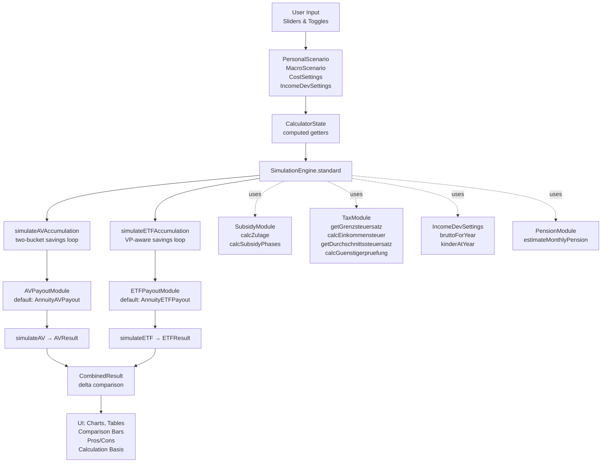
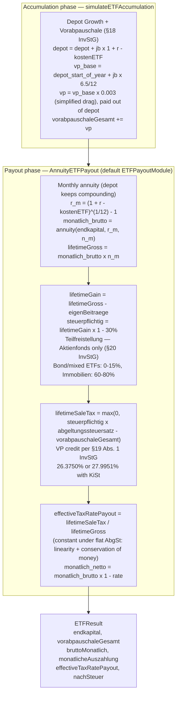
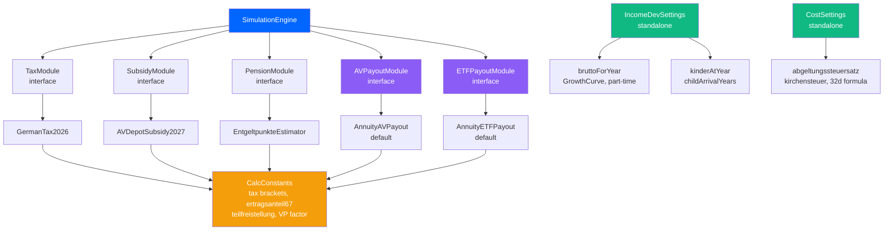

# Calculation Map

End-to-end trace of how user inputs flow through the calculation engine to produce results.

## Pipeline Overview

```mermaid
flowchart TD
    A[User Input<br/>Sliders & Toggles] --> B[PersonalScenario<br/>MacroScenario<br/>CostSettings<br/>IncomeDevSettings]
    B --> C[CalculatorState<br/>computed getters]
    C --> D[SimulationEngine.standard]
    D --> ACC1[simulateAVAccumulation<br/>two-bucket savings loop]
    D --> ACC2[simulateETFAccumulation<br/>VP-aware savings loop]
    ACC1 --> AVP[AVPayoutModule<br/>default: AnnuityAVPayout]
    ACC2 --> ETP[ETFPayoutModule<br/>default: AnnuityETFPayout]
    AVP --> I[simulateAV → AVResult]
    ETP --> J[simulateETF → ETFResult]
    D -.uses.-> E[SubsidyModule<br/>calcZulage<br/>calcSubsidyPhases]
    D -.uses.-> F[TaxModule<br/>getGrenzsteuersatz<br/>calcEinkommensteuer<br/>getDurchschnittssteuersatz<br/>calcGuenstigerpruefung]
    D -.uses.-> G[IncomeDevSettings<br/>bruttoForYear<br/>kinderAtYear]
    D -.uses.-> H[PensionModule<br/>estimateMonthlyPension]
    I --> K[CombinedResult<br/>delta comparison]
    J --> K
    K --> L[UI: Charts, Tables<br/>Comparison Bars<br/>Pros/Cons<br/>Calculation Basis]
```

The accumulation methods (`simulateAVAccumulation` / `simulateETFAccumulation`)
are exposed publicly so integrators can drive a savings-phase-only UI before
wiring up the payout modules. `simulateAV` / `simulateETF` chain accumulation
+ the corresponding payout module and assemble the final `AVResult` / `ETFResult`.

---

## Input Model Mapping

| UI Input | Model Field | Unit | Used By |
|----------|------------|------|---------|
| Monthly Savings | `PersonalScenario.sparrate` | EUR/month | `jahresbeitrag` x12, subsidy calc, depot accumulation |
| Gross Annual Income | `PersonalScenario.brutto` | EUR/year | tax rate, pension EP, income dev base |
| Number of Children | `PersonalScenario.kinder` | count | Kinderzulage (may change with child timing) |
| Starting Age | `PersonalScenario.alterStart` | years | Berufseinsteigerbonus eligibility, savings duration |
| Retirement Age | derived as `spardauer` | years | payout duration (85 - retirement age) |
| State Pension | `PersonalScenario.gesetzlicheRente` | EUR/month | retirement tax calculation |
| Other Income | `PersonalScenario.sonstigeEinkuenfte` | EUR/year | retirement tax calculation |
| Return p.a. | `MacroScenario.rendite` | ratio/year | depot growth |
| Inflation p.a. | `MacroScenario.inflation` | ratio/year | real value calculation |
| AV Cost | `CostSettings.kostenAV` | ratio/year | deducted from return |
| ETF Cost | `CostSettings.kostenETF` | ratio/year | deducted from return |
| Kirchensteuer | `CostSettings.kirchensteuerpflichtig` | bool (rate fixed at 9% via `CalcConstants.kirchensteuersatz`) | `abgeltungssteuersatz` getter, AV payout tax |
| Income Growth | `IncomeDevSettings.*` | various | year-by-year brutto, dynamic kinder |

---

## AV-Depot Simulation Flow

```mermaid
flowchart TD
    subgraph ACC["Accumulation phase — simulateAVAccumulation"]
        direction TB
        SPLIT["Contribution Split<br/>jbCapped = min jahresbeitrag, 6840<br/>jbGefoerdert = min jbCapped, 1800<br/>jbUngefoerdert = jbCapped - jbGefoerdert"]
        subgraph LOOP["For each savings year j = 0 ... spardauer-1"]
            direction TB
            INC["Income for year j<br/>bruttoJ = bruttoForYear brutto, j<br/>kinderJ = kinderAtYear kinder, j"]
            SUB["Subsidies - SubsidyModule<br/>Grundzulage: 50% x min jbGef, 360 + 25% x rest<br/>Kinderzulage: min jbGef, 300 x kinderJ, age-out at 18 or 25<br/>Bonus: 200 EUR if age lt 25 AND j == 0"]
            TAX["Tax Optimization - TaxModule<br/>gstJ = getGrenzsteuersatz bruttoJ<br/>Sonderausgaben = min jb, 1800 + zulagen x gstJ<br/>Refund = difference, to bank account"]
            GROW["Depot Growth - two buckets, tax-free<br/>depotGef = depotGef + jbGef + zulagen x 1 + r - kostenAV<br/>depotUngef = depotUngef + jbUngef x 1 + r - kostenAV"]
            INC --> SUB --> TAX --> GROW
        end
        SPLIT --> LOOP
    end
    GROW --> PAY
    subgraph PAY["Payout phase — AnnuityAVPayout (default AVPayoutModule)"]
        direction TB
        PENS["Pension Estimation<br/>Priority: override, income-dev EP, static<br/>EP = Sum min bruttoJ, BBG / Durchschnittsentgelt x Rentenwert"]
        ANN["Monthly annuity per bucket (depot keeps compounding)<br/>r_m = (1 + r - kostenAV)^(1/12) - 1; n_m = auszahlungsDauer x 12<br/>monatlich_gef   = annuity(depotGef, r_m, n_m)<br/>monatlich_ungef = annuity(depotUngef, r_m, n_m)"]
        RTAX["Incremental §32a tax on AV taxable income<br/>baseIncome = pension x 12 + sonstige<br/>avTaxable = jahresGef + jahresUngef x 0.17 (Ertragsanteil 67)<br/>taxOnAV = calcEinkommensteuer(baseIncome + avTaxable) - calcEinkommensteuer(baseIncome)<br/>avPayoutTaxRate = taxOnAV / avTaxable"]
        GEF["Gefoerdert: 100% taxed<br/>netto_gef = brutto_gef x 1 - avPayoutTaxRate x kirchensteuerFaktor"]
        UNGEF["Ungefoerdert: Ertragsanteilbesteuerung<br/>17% of payout taxed at avPayoutTaxRate, assumes age-67 entry<br/>netto_ungef = brutto_ungef x 1 - 0.17 x avPayoutTaxRate x kirchensteuerFaktor"]
        PENS --> ANN --> RTAX
        RTAX --> GEF
        RTAX --> UNGEF
    end
    GEF --> RES[AVResult<br/>endkapital, monatlicheAuszahlung, nettoMonatlich<br/>grenzsteuersatzRente, zulagenGesamt, wertzuwachs]
    UNGEF --> RES
```

---

## ETF-Depot Simulation Flow

```mermaid
flowchart TD
    subgraph ACC["Accumulation phase — simulateETFAccumulation"]
        direction TB
        GROW["Depot Growth + Vorabpauschale (§18 InvStG)<br/>depot = depot + jb x 1 + r - kostenETF<br/>vp_base = depot_start_of_year + jb x 6.5/12<br/>vp = vp_base x 0.003 (simplified drag), paid out of depot<br/>vorabpauschaleGesamt += vp"]
    end
    GROW --> PAY
    subgraph PAY["Payout phase — AnnuityETFPayout (default ETFPayoutModule)"]
        direction TB
        ANN["Monthly annuity (depot keeps compounding)<br/>r_m = (1 + r - kostenETF)^(1/12) - 1<br/>monatlich_brutto = annuity(endkapital, r_m, n_m)<br/>lifetimeGross = monatlich_brutto x n_m"]
        TEIL["lifetimeGain = lifetimeGross - eigenBeitraege<br/>steuerpflichtig = lifetimeGain x 1 - 30%<br/>Teilfreistellung — Aktienfonds only (§20 InvStG)<br/>Bond/mixed ETFs: 0-15%, Immobilien: 60-80%"]
        ABGST["lifetimeSaleTax = max(0, steuerpflichtig x abgeltungssteuersatz - vorabpauschaleGesamt)<br/>VP credit per §19 Abs. 1 InvStG<br/>26.3750% or 27.9951% with KiSt"]
        RATE["effectiveTaxRatePayout = lifetimeSaleTax / lifetimeGross<br/>(constant under flat AbgSt: linearity + conservation of money)<br/>monatlich_netto = monatlich_brutto x 1 - rate"]
        ANN --> TEIL --> ABGST --> RATE
    end
    RATE --> RES[ETFResult<br/>endkapital, vorabpauschaleGesamt<br/>bruttoMonatlich, monatlicheAuszahlung<br/>effectiveTaxRatePayout, nachSteuer]
```

---

## Module Dependency Map

```mermaid
flowchart TD
    SE[SimulationEngine] --> TM[TaxModule<br/>interface]
    SE --> SM[SubsidyModule<br/>interface]
    SE --> PM[PensionModule<br/>interface]
    SE --> AVP[AVPayoutModule<br/>interface]
    SE --> ETP[ETFPayoutModule<br/>interface]

    TM --> GT[GermanTax2026]
    SM --> AVS[AVDepotSubsidy2027]
    PM --> EPE[EntgeltpunkteEstimator]
    AVP --> ANV[AnnuityAVPayout<br/>default]
    ETP --> ANE[AnnuityETFPayout<br/>default]

    GT --> CC[CalcConstants<br/>tax brackets, ertragsanteil67<br/>teilfreistellung, VP factor]
    AVS --> CC
    EPE --> CC
    ANV --> CC
    ANE --> CC

    IDS[IncomeDevSettings<br/>standalone] --> BFY[bruttoForYear<br/>GrowthCurve, part-time]
    IDS --> KAY[kinderAtYear<br/>childArrivalYears]

    CS[CostSettings<br/>standalone] --> ABS[abgeltungssteuersatz<br/>kirchensteuer, 32d formula]

    style SE fill:#0066FF,color:#fff
    style CC fill:#F59E0B,color:#fff
    style IDS fill:#10B981,color:#fff
    style CS fill:#10B981,color:#fff
    style AVP fill:#8B5CF6,color:#fff
    style ETP fill:#8B5CF6,color:#fff
```

---

## What Affects What

| Changed Input | Affects Depot Capital | Affects Net Payout | Affects Subsidies |
|---------------|----------------------|-------------------|-------------------|
| Savings Rate | yes, directly | yes | yes, via contribution |
| Gross Income | no | yes, retirement tax | no |
| Children | no | no | yes, Kinderzulage |
| Starting Age | yes, longer compounding | yes | yes, Berufseinsteigerbonus |
| Retirement Age | yes, duration | yes, payout years | no |
| State Pension | no | yes, retirement tax | no |
| Other Income | no | yes, retirement tax | no |
| Return p.a. | yes, directly | yes | no |
| AV/ETF Cost | yes, reduces return | yes | no |
| Kirchensteuer | no | yes, both AV + ETF | no |
| Income Growth | no | yes, pension + tax | no |
| Macro Scenario | yes, return + inflation | yes | no |

---

## File Locations

| Component | File |
|-----------|------|
| SimulationEngine + CalcConstants | `lib/services/domain/calculator_service.dart` |
| TaxModule + GermanTax2026 | `lib/services/domain/tax_module.dart` |
| SubsidyModule + AVDepotSubsidy2027 | `lib/services/domain/subsidy_module.dart` |
| PensionModule + EntgeltpunkteEstimator | `lib/services/domain/pension_module.dart` |
| AVPayoutModule, ETFPayoutModule + Annuity defaults + payout result types | `lib/services/domain/payout_module.dart` |
| IncomeDevSettings + GrowthCurve | `lib/models/income_dev_settings.dart` |
| PersonalScenario, MacroScenario, CostSettings, AVAccumulation, ETFAccumulation, AVResult, ETFResult | `lib/models/scenario.dart` |
| CalculatorCubit (state management) | `lib/features/calculator/cubit/calculator_cubit.dart` |
| CalculatorState (computed getters) | `lib/features/calculator/cubit/calculator_state.dart` |
